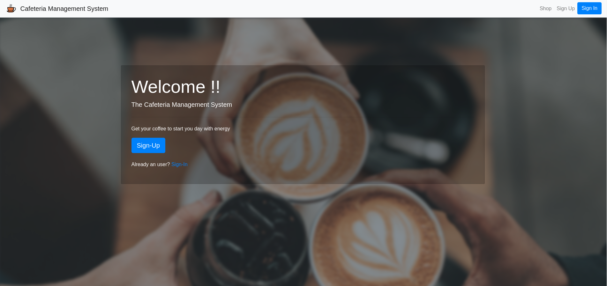
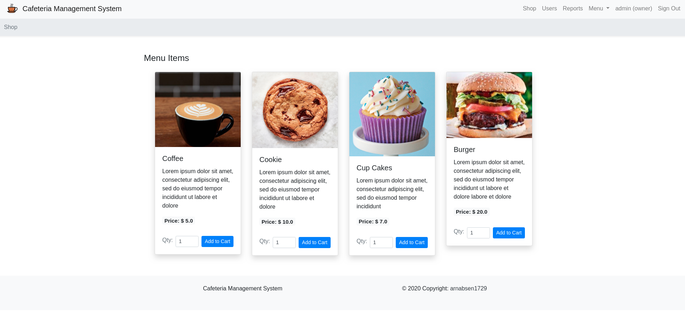
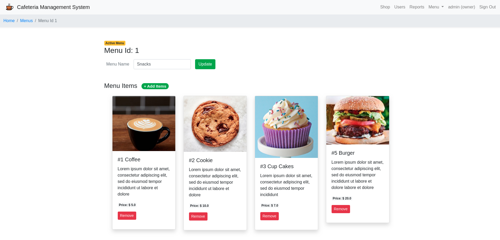
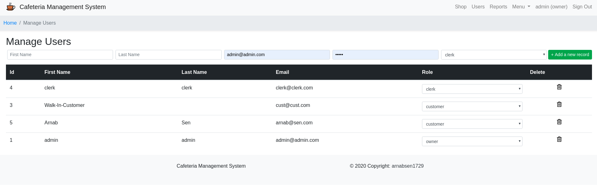

# Cafeteria Management System

## Introduction
This is a cafeteria management system. The features impleted were:

**User**
 - [X] Sign In/Sign Out
 - [X] See the menu with images, description, price.
 - [X] Add Items to cart (quantity enabled)
 - [X] Cart Page
	 - [X]  Delete items
	 - [X] See a summary
	 - [X] Total
 - [X] Place Order

**Clerk**
- [X] Sign-In/ Sign-Out
- [X] List of all orders
	- [X] Pending orders can be marked delivered
- [X] Create orders on behalf of "Walk-In-Customer"

**Owner**

- [X] Sign-In / Sign-Out
- [X] Manage User
	- [X] List of all users
	- [X] Delete users
	- [X] Update roles of users / clerks
	- [X] Add new users / clerks
- [X] Manage Menus
	- [X] List all menus
	- [X] Create new menus
	- [X] Update existing menus
	- [X] Add items to menus
		- [X] Item Image upload
		- [X] Description
		- [X] Name
	- [X] Select an active menu
- [X] Reports
	- [X] List of all orders
	- [X] Choose a date range
	- [X] Individual orders invoices
	- [X] Details of all orders by a customer

## Deployed App

VPS App: http://52.87.229.223/   [Active Storage is persistent]

Heroku App: https://cafeteria-management-system.herokuapp.com/ [Active Storage is not persistent]

**Admin Credentials**

|           |                   |
| --------- | ----------------- |
| Email:    | `admin@admin.com` |
| Password: | `admin`           |

**Clerk Credentials**
|           |                   |
| --------- | ----------------- |
| Email:    | `clerk@clerk.com` |
| Password: | `clerk`           |

**Users**
|           |                 |
| --------- | --------------- |
| Email:    | `arnab@sen.com` |
| Password: | `arnab`         |

User can sign-up and create new accounts.

By default all the accounts will be created with the role of a "customer". Only the owner(admin) can change the roles.

## Demonstration

## Development

1. Clone the repo
2. Install the packages `bundle install`
3. Make sure postgresql is running
4. Change the username and password in `config/database.yml`
5. Create and migrate database using `rails db:create db:migrate`
6. Also make sure you seed the database `rails db:seed`
7. Now run the server `rails s` and go to `localhost:8000`

## Snapshots

### Landing Page

### Shop Page

### Menu Page

### Manage Users Page

